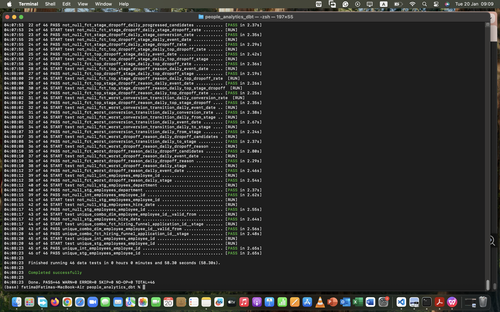
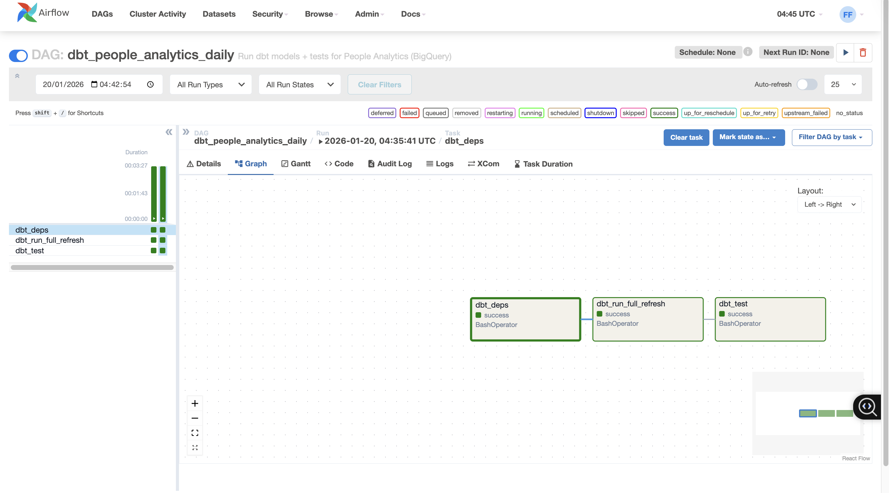

# People Analytics dbt on BigQuery + Airflow Orchestration

## Overview
This repository demonstrates an analytics engineering workflow using **dbt** on **BigQuery** and orchestration via an **Airflow DAG**.

## KPI definitions (business-ready)

This project builds a trusted KPI layer for funnel reporting using analytics engineering patterns (staging → intermediate → marts). The KPIs are designed to be stable, testable, and dashboard-ready.

| KPI | What it answers | Definition | Grain |
|---|---|---|---|
| Funnel conversion rate | Where do candidates drop? | % moving from one stage to the next (e.g., Applied → Screen → Interview → Offer → Hired) | Daily / Weekly |
| Stage drop-off rate | Which stage is bottleneck? | % lost at each stage (1 - stage conversion rate) | Daily / Weekly |
| Cohort retention | Is performance improving? | Retention % by cohort period (e.g., hired cohort retained in week 1/4) | Weekly / Monthly |

## Deliverables (portfolio completion checklist)

- [ ] Staging models (clean + typed): `stg_*`
- [ ] Intermediate models (reusable joins/logic): `int_*`
- [ ] Marts: `dim_*`, `fct_*`
- [ ] KPI marts: funnel conversion, stage drop-off, cohort retention
- [ ] Tests + contracts in `schema.yml`
- [ ] Documentation + model descriptions
- [ ] Dashboard screenshot
- [ ] Proof screenshots: `dbt run`, `dbt test`, lineage, dashboard

## Outcome

By the end of this project, the repository will provide a complete analytics engineering case study that produces a governed KPI layer (funnel conversion, drop-off, and cohort retention). The output is designed to power executive reporting and dashboards with consistent metric definitions, automated tests, and clear documentation.


## Key artifacts
- `dags/dag_dbt_payments_domain.py` — Airflow DAG that triggers dbt runs
- `models/` — dbt models (staging → intermediate → marts)
- `tests/` — dbt tests (not_null / unique / relationships / accepted_values)

## How to run (local)
1. Configure BigQuery credentials for dbt (service account JSON).
2. Install dependencies in a virtual environment.
3. Run:
   - `dbt debug`
   - `dbt run`
   - `dbt test`
4. Start Airflow and trigger the DAG from the UI.

## Proof screenshots
Add screenshots into `docs/screenshots/` and reference them here (Airflow UI run, dbt run graph, BigQuery tables/views).
## Proof (Git Clean State)


## Proof / Evidence

✅ dbt tests passing (PASS=46, ERROR=0)



## Airflow Orchestration Proof

**Airflow DAGs registered**


**Successful run**


## Airflow Orchestration Proof (Local)

Airflow DAG executed successfully (dbt deps → dbt run → dbt test):


### Day 10 — Airflow DAG Orchestration (SUCCESS)

**Airflow DAG:** `dbt_people_analytics_daily`  
Tasks: `dbt_deps → dbt_run_full_refresh → dbt_test`

**Graph View**


**Successful Run**


## Cost-aware warehouse notes (BigQuery)

This repository is intentionally structured to showcase **cost-aware analytics engineering** on BigQuery—optimizing for **low bytes scanned**, **minimal storage duplication**, and **fast BI performance**.

### Materialization strategy
- **Staging (`stg_*`)**: materialized as **views** to keep the warehouse lightweight and avoid duplicating raw/source data.
- **Intermediate (`int_*`)**: materialized as **tables only when it pays off** (reused joins/transforms that would otherwise be recomputed).
- **Marts (`dim_*`, `fct_*`)**: tuned for consumption:
  - Use **views** when you want low storage and acceptable latency.
  - Use **tables** when you need consistent dashboard performance or heavy reuse.

### Query efficiency principles
- Avoid `SELECT *` in marts; project only required columns to reduce **bytes scanned**.
- Centralize expensive logic into **reusable intermediate tables** to prevent repeated recomputation across marts.
- Prefer **BI-friendly marts** to reduce query complexity and improve interactive performance.

### Partitioning & clustering (production pattern)
For large fact tables (e.g., `fct_*`):
- **Partition** by a date column (e.g., `event_date`, `snapshot_date`) to reduce scanned partitions.
- **Cluster** by common filter/join keys (e.g., `employee_id`, `department_id`) to improve pruning and join efficiency.
- Result: **lower scan cost + faster interactive queries**.

### Sandbox / billing constraints
- BigQuery Sandbox may restrict some **DML** operations; **snapshot-style SCD2** workflows may require a billing-enabled project.
- This repo includes **local proof (DuckDB)** for incremental/SCD2 patterns when warehouse DML is restricted, while keeping the BigQuery structure aligned with production best practices.

### CI as a cost guardrail
To avoid unnecessary warehouse spend on every change:
- GitHub Actions runs **`dbt deps` + `dbt parse`** as a lightweight validation gate.
- Optionally run **targeted `dbt test`** on key marts (primary keys + relationships) instead of full refreshes.


```mermaid
flowchart TB

  subgraph ORCH["Airflow Orchestration"]
    DAG["dag_dbt_people_domain"] --> DEPS["dbt deps"] --> RUN["dbt run"] --> TEST["dbt test"]
  end

  subgraph SRC["Sources"]
    HRIS["HRIS"]
    ATS["ATS"]
    PERF["Performance"]
    COMP["Compensation"]
  end

  subgraph STG["Staging"]
    STG_HRIS["stg_hris_employees"]
    STG_ATS["stg_ats_candidates"]
    STG_PERF["stg_perf_reviews"]
    STG_COMP["stg_comp_salaries"]
  end

  subgraph INT["Intermediate"]
    INT_EMP["int_employee_enriched"]
    INT_FUN["int_hiring_funnel_steps"]
  end

  subgraph MART["Marts"]
    DIM_EMP["dim_employee"]
    FCT_FUN["fct_hiring_funnel"]
  end

  HRIS --> STG_HRIS
  ATS --> STG_ATS
  PERF --> STG_PERF
  COMP --> STG_COMP

  STG_HRIS --> INT_EMP
  STG_PERF --> INT_EMP
  STG_COMP --> INT_EMP

  STG_ATS --> INT_FUN

  INT_EMP --> DIM_EMP
  INT_FUN --> FCT_FUN
  DIM_EMP --> FCT_FUN

