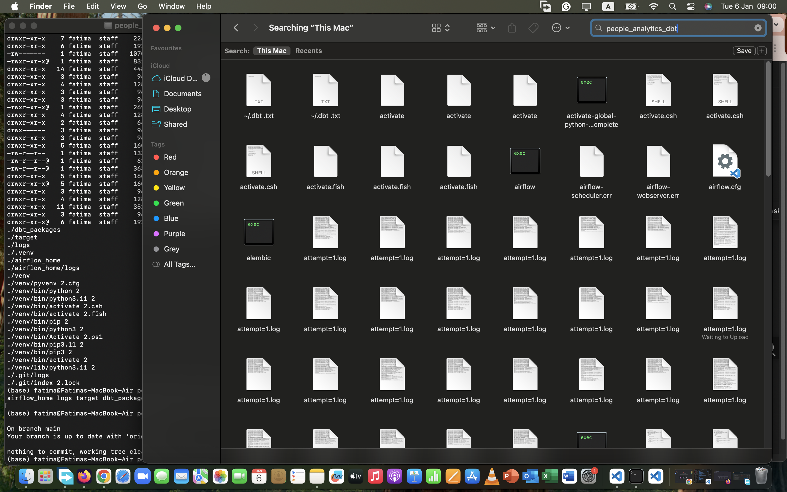
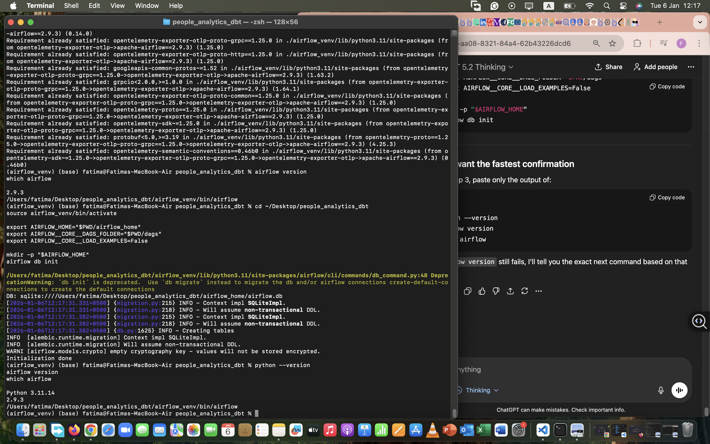

# People Analytics dbt on BigQuery + Airflow Orchestration

## Overview
This repository demonstrates an analytics engineering workflow using **dbt** on **BigQuery** and orchestration via an **Airflow DAG**.

## Key artifacts
- `dags/dag_dbt_payments_domain.py` — Airflow DAG that triggers dbt runs
- `models/` — dbt models (staging → intermediate → marts)
- `tests/` — dbt tests (not_null / unique / relationships / accepted_values)

## How to run (local)
1. Configure BigQuery credentials for dbt (service account JSON).
2. Install dependencies in a virtual environment.
3. Run:
   - `dbt debug`
   - `dbt run`
   - `dbt test`
4. Start Airflow and trigger the DAG from the UI.

## Proof screenshots
Add screenshots into `docs/screenshots/` and reference them here (Airflow UI run, dbt run graph, BigQuery tables/views).
## Proof (Git Clean State)

## Airflow Orchestration Proof

**Airflow DAGs registered**

**Successful run**

## Airflow Orchestration Proof (Local)

Airflow DAG executed successfully (dbt deps → dbt run → dbt test):

flowchart TB
  A[Airflow DAG dag_dbt_people_domain] --> B[dbt deps]
  B --> C[dbt run]
  C --> D[dbt test]

  subgraph SRC[Sources]
    S1[(HRIS)]
    S2[(ATS)]
    S3[(Performance)]
    S4[(Compensation)]
  end

  subgraph STG[Staging]
    ST1[stg_hris_employees]
    ST2[stg_ats_candidates]
    ST3[stg_perf_reviews]
    ST4[stg_comp_salaries]
  end

  subgraph INT[Intermediate]
    I1[int_employee_enriched]
    I2[int_hiring_funnel_steps]
  end

  subgraph MART[Marts]
    M1[dim_employee]
    M2[fct_hiring_funnel]
  end

  S1 --> ST1
  S2 --> ST2
  S3 --> ST3
  S4 --> ST4

  ST1 --> I1
  ST3 --> I1
  ST2 --> I2

  I1 --> M1
  I2 --> M2

  D --> MART

